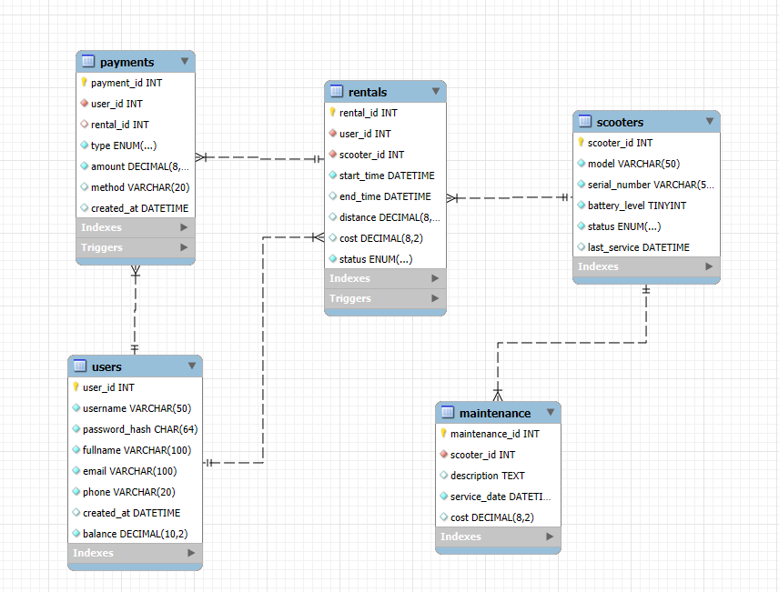

# База данных для сервиса аренды электросамокатов  



+ [Типовые запросы](#типовые-запросы)  
- [View-представления](#view-представления)  
* [Хранимые процедуры](#хранимые-процедуры)  
+ [Триггеры](#триггеры)

> [!IMPORTANT]  
> ## Для развёртывания БД и тестовых данных необходимо скачать и выполнить файл `dump.sql`

---

## 📌 Типовые запросы:

### Доступные самокаты с зарядом выше 20%:

```sql
SELECT * FROM scooters
WHERE status = 'available' AND battery_level >= 20;
```

### Баланс конкретного пользователя:

```sql
SELECT user_id, username, balance
FROM users
WHERE username = 'alice';
```

### Активная аренда пользователя:

```sql
SELECT * FROM rentals
WHERE user_id = 1 AND status = 'active';
```

### Статистика пользователя:

```sql
SELECT COUNT(*) AS total_rentals,
       SUM(distance) AS total_km,
       SUM(cost) AS total_cost
FROM rentals
WHERE user_id = 1 AND status = 'completed';
```

### История платежей пользователя:

```sql
SELECT * FROM payments
WHERE user_id = 1
ORDER BY created_at DESC;
```

---

## 📊 View-представления:

### Активные аренды:

```sql
SELECT * FROM active_rentals;
```

### Статистика по каждому пользователю:

```sql
SELECT * FROM user_rental_summary;
```

### Статистика по каждому самокату:

```sql
SELECT * FROM scooter_usage_stats;
```

---

## ⚙️ Хранимые процедуры:

### Пополнение баланса:

```sql
CALL top_up_balance(1, 200.00);
```

### Начало аренды:

```sql
CALL start_rental(1, 2);
```

### Завершение аренды с передачей дистанции (в км):

```sql
CALL end_rental(1, 3.5);
```

---

## 🔄 Триггеры:

### Обновление баланса пользователя при любом платеже:

```sql
-- trg_update_user_balance (AFTER INSERT ON payments)
```

### Автоматическое переключение статуса самоката в “rented” при начале аренды:

```sql
-- trg_update_scooter_status_on_rental (AFTER INSERT ON rentals)
```

### Освобождение самоката после завершения аренды:

```sql
-- trg_free_scooter_on_rental_end (AFTER UPDATE ON rentals)
```
